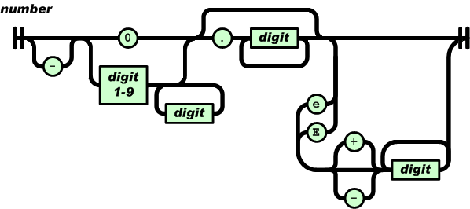
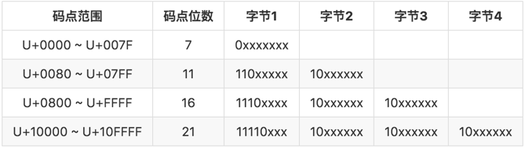

## [miloyip/json-tutorial](https://github.com/miloyip/json-tutorial)

```cmake
cmake -Bbuild -H.
cmake --build build
```

### 01
`json`中有 6 种数据类型:
- null
- 布尔值: true | false
- 数字（浮点数表示）
- 字符串
- 数组
- json对象
```c
typedef enum {
    LEPT_NULL,
    LEPT_FALSE, LEPT_TRUE,
    LEPT_NUMBER,
    LEPT_STRING,
    LEPT_ARRAY,
    LEPT_OBJECT
} lept_type;
```
主要数据结构--节点
```c
typedef struct {
    lept_type type;
} lept_value;
```

关于类似`null x`存在冗余字符的判断
```c
int lept_parse(lept_value* v, const char* json) {
    lept_context c;
    assert(v != NULL);
    c.json = json;
    v->type = LEPT_NULL;
    lept_parse_whitespace(&c);
    int ret;
    /* 定义在这里，而不是每种类型的解析函数单独判断，这里将异常处理提升了一个层级 */
    if ((ret = lept_parse_value(&c, v)) == LEPT_PARSE_OK) {
        lept_parse_whitespace(&c);
        if (*c.json != '\0')
            ret = LEPT_PARSE_ROOT_NOT_SINGULAR;
    }
    return ret;
}
```

对于字符的匹配，这里是按数组索引访问，因为是`null-terminate-string`最后结尾是`\0`不会满足下述判断，短路不会比较后面的，也就不会造成越界访问。
```c
if (c->json[0] != 'a' || c->json[1] != 'l' || c->json[2] != 's' || c->json[3] != 'e')
```

## 02


在 C 语言中，数组长度、索引值最好使用 size_t 类型，而不是 int 或 unsigned。

## 03 
字符串一般表示为空结尾字符串（null-terminated string），json 字符串是允许含有空字符的，例如这个 json `Hello\u0000World`就是单个字符串。

[动态数组增长因子确定](https://github.com/facebook/folly/blob/main/folly/docs/FBVector.md)

统一字符集码点范围：`0 ~ 0x10FFFF`，表达形式：U+XXXX `XXXX`是 4 个 16 进制数字，例如：慧 -- `U+6167`。UTF - Unicode 转换格式。

如果第一个码点是 U+D800 至 U+DBFF，我们便知道它的代码对的高代理项（high surrogate），之后应该伴随一个 U+DC00 至 U+DFFF 的低代理项（low surrogate）。
```
codepoint = 0x10000 + (H − 0xD800) × 0x400 + (L − 0xDC00)
```



## 04 
C 语言的数组大小应该使用 size_t 类型。